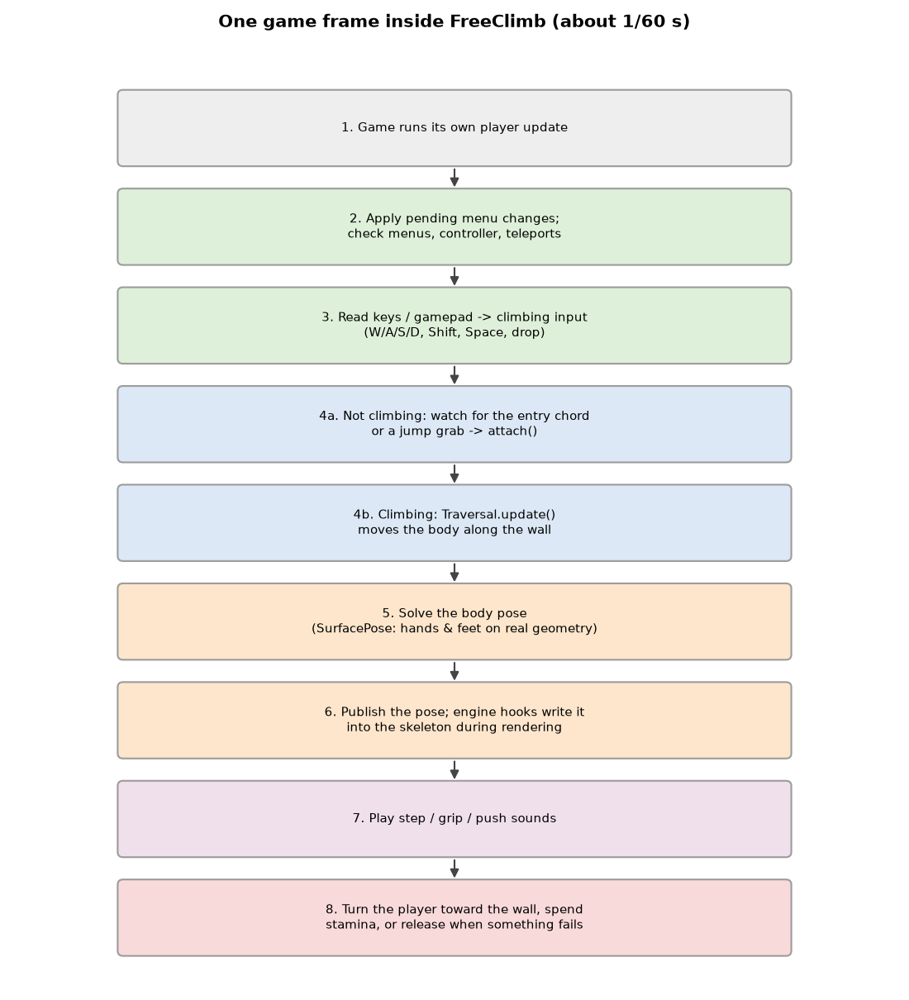
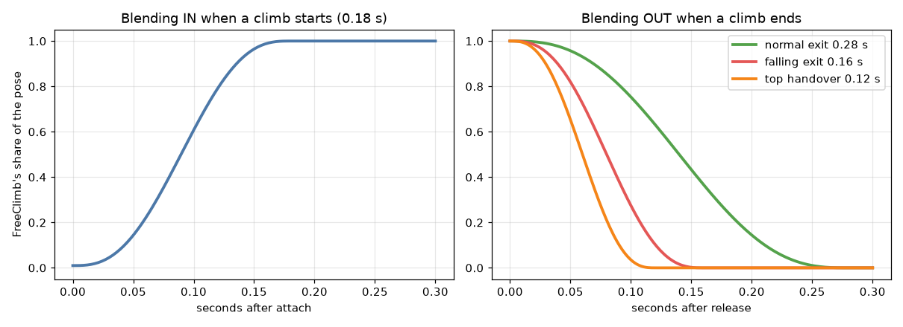

# FreeClimb — the plugin that runs inside Skyrim

**FreeClimb** · [FreeClimbAnimationInput](FreeClimbAnimationInput.md) · [FreeClimbSettings](FreeClimbSettings.md)

This project builds `FreeClimb.dll`, the file SKSE loads into Skyrim. It is
the **bridge** between the game and the two libraries:

* it **listens** to the keyboard and gamepad,
* it **asks the game** about walls (physics rays),
* it **runs** the climbing brain from
  [FreeClimbAnimationInput](FreeClimbAnimationInput.md) every frame,
* it **puts the resulting pose** on the player's skeleton,
* it **plays sounds**, **turns the player** toward the wall and
  **shows the settings menu** (using
  [FreeClimbSettings](FreeClimbSettings.md)).


```text
FreeClimb/
├─ include/
│  ├─ plugin/     pieces of Plugin.cpp: state, helpers, world, motion,
│  │              entry, per-frame update, hooks, settings service
│  ├─ pose/       pose output into the game (PoseRuntime) and blending
│  ├─ scene/      binding bones to the game's scene graph
│  ├─ ray/        filtered Havok ray casts
│  ├─ audio/      traversal sounds
│  ├─ runtime/    supported game versions, memory checks, log file
│  ├─ animation/  graph variable setters, skeleton binding, AnimationState
│  ├─ input/ view/ settings/ traversal/   capture, camera heading, menu API,
│  │              diagnostics helpers
│  ├─ vendor/     SKSE Menu Framework and True Directional Movement APIs
│  └─ PCH.h       precompiled header
├─ src/           Plugin.cpp (entry point), SettingsMenu.cpp (menu UI)
└─ xmake.lua      builds FreeClimb.dll and installs it to SKSE/Plugins
```

---

## Contents

1. [Words used in this document](#1-words-used-in-this-document)
2. [Starting up](#2-starting-up)
3. [Every frame](#3-every-frame)
4. [Seeing the world: GameWorld](#4-seeing-the-world-gameworld)
5. [Starting and ending a climb](#5-starting-and-ending-a-climb)
6. [Putting the pose on the player](#6-putting-the-pose-on-the-player)
7. [Sounds](#7-sounds)
8. [Keyboard and gamepad hooks](#8-keyboard-and-gamepad-hooks)
9. [Settings menu and safe reloads](#9-settings-menu-and-safe-reloads)
10. [Staying safe across game versions](#10-staying-safe-across-game-versions)
11. [Diagnostics](#11-diagnostics)
12. [File reference](#12-file-reference)

---

## 1. Words used in this document

| Word | Plain meaning |
| --- | --- |
| **SKSE** | Skyrim Script Extender; it loads `.dll` plugins into the game. |
| **Hook** | Replacing one of the game's internal functions with ours, which usually calls the original too. |
| **vtable** | A table of function addresses inside the game; hooks are installed by changing one entry. |
| **Address Library** | A community database mapping stable IDs to function addresses for each game version. |
| **Animation graph** | The game's own animation state machine for the player. |
| **Scene graph** | The tree of 3D nodes (bones, meshes) the game draws every frame. |
| **TDM** | *True Directional Movement*, a popular mod that also turns the player; FreeClimb cooperates with it. |

---

## 2. Starting up

```text
 Game starts
   │
   ├─ SKSEPluginLoad ─────────────────────────────────────────────────────┐
   │   1. open the log  Data/SKSE/FreeClimb.log                           │
   │   2. check the game version is on the supported list                 │
   │      (SE 1.5.97, AE 1.6.317 … 1.6.1179, 1.7.99, 1.7.104)             │
   │   3. initialize SKSE, check the executable matches                   │
   │   4. load FreeClimb.ini (FreeClimbSettings)                          │
   │   5. register "release the climb" on save and on load-revert         │
   │   6. listen to SKSE messages                                         │
   └──────────────────────────────────────────────────────────────────────┘
   │
   ├─ kPostLoad (all plugins loaded)
   │     register the settings menu (if SKSE Menu Framework is installed)
   │     connect to True Directional Movement (if installed)
   │
   ├─ kDataLoaded (game data ready) → initializeRuntime()
   │     a. verify every hook site in memory (runtimeHooksReady)
   │     b. find the vanilla sound forms (TraversalAudioRuntime)
   │     c. load the animation pack + install scene hooks (PoseRuntime)
   │     d. measure the Threepeat clips into the climbing settings
   │     e. hook the player's per-frame update
   │     f. hook the keyboard and gamepad devices
   │     g. guard 12 vanilla input handlers (move, jump, sneak, sprint, …)
   │     h. listen for menus opening
   │
   └─ kPreLoadGame / kNewGame / kPostLoadGame
         release any climb and reset input, so loading never leaves
         the player stuck on a wall
```

If any check in step (a) or (c) fails, **nothing is hooked** and the game
keeps running normally; the reason is in the log and in the menu status.

---

## 3. Every frame



The hooked player update (`plugin/Update.h`) runs once per frame:

```text
 update(player, dt)
   │
   ├─ run the game's original update first
   ├─ apply settings the menu asked for (on the game thread)
   ├─ input suspended? (menu open, console, window not focused) → release
   ├─ actor not allowed? (dead, swimming, weapon drawn, mounted,
   │                      sitting, knocked down…)              → release
   ├─ controller / cell / teleport changed?                    → release
   │
   ├─ NOT climbing ───────────────────────────────────────────────────┐
   │   watch the entry chord and the jump-grab window;               │
   │   on a request: prepare the pose binding, then try attach()     │
   │   (see §5)                                                      │
   └─ climbing ───────────────────────────────────────────────────────┘
       1. Traversal.update(GameWorld, input, dt, stamina)
       2. the pose solver fits the body to the wall; publish the pose
       3. play traversal sounds for this frame
       4. turn the player toward the wall
       5. subtract stamina; warn when it is low
       6. any failure → release with a reason
```

---

## 4. Seeing the world: GameWorld

The climbing brain only knows `World::ray(from, to)`. `plugin/GameWorld.h`
answers it with **real Havok physics rays**, but it has to hide some things:

| Hit | Decision | Why |
| --- | --- | --- |
| The player's own body | ignored | You cannot climb yourself. |
| An invisible trigger volume (ActorZone layer, only reports contacts) | ignored | Doors, traps and quest areas are not walls. |
| An invisible activator with no model | ignored | Same reason. |
| Another actor | kept | NPCs block your path. |
| Everything else | kept | Real geometry. |

```text
   ray ──► Havok "closest hit" collector
             │  for every hit:
             │    walk up to the root collidable
             │    keep(root)?  ── no ──► skip, look for the next hit
             │        │ yes
             ▼        ▼
          original engine collector records it → closest kept hit wins
```

The filtering collector (`ray/FilteredRayCollector.h`) mimics the engine's
own collector byte for byte. Before it is used, the engine functions are
**verified** (on SE even their exact machine-code bytes). If verification
fails, FreeClimb falls back to plain, unfiltered rays — less precise, but
safe.

---

## 5. Starting and ending a climb

### 5.1 Starting

```text
 entry chord or jump at a wall
   │
   ├─ PoseRuntime.prepare()   bind the skeleton; wait until the game's
   │                          pose callback has run recently (≤ 250 ms)
   ├─ Traversal.attach()      find a wall (see AnimationInput §3.4)
   └─ acquire()               take control:
        - refuse if another mod's animation is running (bIsSynced,
          SkyParkour), or TDM is target-locked
        - ask TDM for yaw control (if installed)
        - set bIsSynced = true on the animation graph
        - PoseRuntime.attach(): start blending our pose in
        - take the character controller and switch gravity off
        - remember the cell / worldspace (a teleport releases)
        - remember the run/walk toggle to restore it later
```

If **any** step fails, everything already taken is given back
immediately.

### 5.2 Ending: `release()`

Every way out of a climb goes through `release(player, reason, …)`:

```text
 release
   ├─ stop sounds, cancel pending grabs
   ├─ start blending the pose out (or cut it)
   ├─ restore gravity, give the controller back
   ├─ bIsSynced = false, give TDM control back
   ├─ restore the run/walk toggle
   └─ log "Released: <reason>"
```

| Typical reasons | Meaning |
| --- | --- |
| `stamina exhausted`, `support lost after retries` | From the climbing brain. |
| `descending reached ground` | You climbed down onto the floor. |
| `menu opened`, `save`, `pre-load`, `revert` | The game is pausing or loading. |
| `actor state`, `controller, cell or teleport change` | Something outside changed the player. |
| `animation output timeout` | The pose stopped reaching the screen (see §6.4). |
| `wall-facing ownership or normal invalid` | Turning toward the wall failed (e.g. TDM refused). |

### 5.3 Facing the wall

The player is turned smoothly toward the wall with a **critically damped
follower** (`view/ViewHeading.h`, at most 6 rad/s, never overshooting).
With TDM installed the yaw is set through TDM's API. The third-person
camera keeps pointing at the same place in the world while the body turns
(`view/CameraHeading.h`), so the view does not swing around.

---

## 6. Putting the pose on the player

This is the most delicate part: Skyrim animates the player itself, and
FreeClimb has to **overwrite** that result at the right moment, every frame,
without fighting the engine.

### 6.1 Binding the skeleton

`PoseRuntime::bindLocked()` connects the 99 canonical bones to the player's
scene graph (`scene/FlatSkeleton.h`, `scene/SceneBinding.h`):

```text
 canonical bone "NPC L Hand [LHnd]"
        │  look up by name
        ▼
 1. the root node itself?
 2. an entry of the flattened bone tree (BSFlattenedBoneTree)?
 3. any node with that name below the root?
```

Camera and weapon attachment bones are left to the engine. Body mods that
change bone lengths are handled by the rig adaptation (see
[AnimationInput §4.4](FreeClimbAnimationInput.md#44-adapting-to-the-real-character-poserig)).

### 6.2 Writing during the scene update

```text
 game's scene update passes (per frame)
   ├─ UpdateDownwardPass          ┐
   ├─ UpdateSelectedDownwardPass  │ hooked: on the player's root node,
   ├─ UpdateRigidDownwardPass     │ apply() writes our pose, then runs
   ├─ UpdateTransformAndBounds    ┘ the original pass
   └─ UpdateWorldData (single node) → lateWorld(): if something updates
                                     one of our bones late, recompute it
                                     from our pose instead of stale data
```

Hooks are installed for three node types (`NiNode`, `BSFadeNode`,
`BSFlattenedBoneTree`). Every other node runs the untouched original.

### 6.3 Blending in and out



* **In:** over 0.18 s when a climb starts.
* **Out:** over 0.28 s normally, 0.16 s when falling, 0.12 s when handing
  over at the top of a mantle.
* The blend only advances on frames where our pose actually reached the
  skeleton, so it can never "finish" off-screen.
* On release while moving (e.g. falling), the last motion **continues**
  for a moment (`PoseContinuation`) instead of freezing.

### 6.4 Watchdogs

| Check | Limit | Result |
| --- | ---: | --- |
| Pose callback not seen recently | 120 ms | Pose output paused (`PoseHealth::ready` false). |
| Pose callback silent (seen before / never seen) | 1.5 s / 0.75 s | Climb released: `animation output timeout`. |
| Character rig changed (new armor, race change, model reload) | — | Output stops at once, climb released, binding rebuilt. |
| Fade-out without output | 0.75 s | Fade is abandoned and cleared. |

---

## 7. Sounds

FreeClimb plays its own wav files (`Data/Sound/fx/FreeClimb/`): **step**,
**grip**, **push** and **top**. It no longer needs an ESP: the sounds are
routed through Skyrim.esm's *footsteps* sound category and a 3D output
model, so they come from the body's position and follow the in-game
footsteps volume slider.

```text
 when does a sound play?               (audio/TraversalAudio.h)
 ───────────────────────
 climbing cycle  : a hand or foot newly takes weight (contact ≥ 0.65)
                   → grip (hand) or step (foot)
 wall run        : at fixed points of the run cycle → step
 hop / drop      : push-off at 10 % → push ; catch near the end → grip
 mantle          : hand on top at 37.5 % → grip ; finished → top
 always          : at most one sound every 85 ms, at most 2 per frame
```


Up to six sounds can overlap; a new one stops the oldest. For diagnostics,
some sounds are checked a few times (12 ms … 750 ms after starting) to log
whether the engine really played them.

---

## 8. Keyboard and gamepad hooks

```text
 keyboard device ──► AttachedSpaceGuard::process ──┐
 gamepad device  ──► GamepadGuard::process ────────┤
                                                   ▼
                     1. sample keys / buttons (also for the menu's key capture)
                     2. update InputState / GamepadState
                     3. remove events that FreeClimb owns from the event list
                                                   │
                                                   ▼
                     game's input handlers (move, jump, sneak, sprint, ready
                     weapon, attack, activate, POV, shout, auto-move, run,
                     toggle run) — each guarded by InputGuard
```

The rules for which key belongs to whom are described in
[FreeClimbSettings §4.3](FreeClimbSettings.md#43-who-gets-the-key-the-game-or-freeclimb).
The device that **started** the climb (keyboard or gamepad) stays in
control until the climb ends; the other device is ignored meanwhile. If a
climb started with the gamepad and the controller disconnects, the climb is
released.

---

## 9. Settings menu and safe reloads

The menu (`src/SettingsMenu.cpp`) runs on the **UI thread**, the climbing
logic on the **game thread**. They never touch each other's data directly:

```text
  menu (UI thread)                         game thread (every frame)
  ───────────────                          ─────────────────────────
  Save  ──► pendingSettings ──┐
  Audio ──► pendingAudio  ────┼──(mutex)──► serviceSettings():
  Reload pack ► pendingReload ┘              apply settings, save the INI,
                                             reload the pack only when you
  ◄── menuSnapshot (status, counters) ───    are safely off the wall
```

* **Pack reload** waits until you are not climbing and no fade is running;
  a pack that fails to load keeps the previous one (all or nothing).
* **Key capture**: "press the keys to bind" records a chord from raw device
  samples; Esc or the gamepad Back button cancels. While capturing, those
  keys are hidden from the game.
* The menu is optional: without SKSE Menu Framework everything still works
  through the INI.

---

## 10. Staying safe across game versions

```text
 runtime/RuntimePolicy.h  : the exact list of supported executables
 runtime/RuntimeSupport.h : "is this memory readable / executable?" checks
                             before every vtable hook (VirtualQuery)
 scene, ray, animation    : code-signature checks of engine functions on SE
                             (exact bytes); a mismatch disables that feature
                             instead of crashing
```

| Situation | Behaviour |
| --- | --- |
| Unsupported game version | Plugin refuses to load (logged). |
| A hook site looks wrong | No hooks at all; FreeClimb stays off. |
| Ray collector cannot be verified | Plain rays (no trigger filtering). |
| Final skin observer unavailable (AE) | Only the diagnostic audit is off. |

---

## 11. Diagnostics

* **Log:** `Data/SKSE/FreeClimb.log`, recreated on every game start.
* **Diagnostics switch** (`[General] Diagnostics=1`): adds timing, ray
  counts, motion statistics, camera/entry traces and controller shape dumps
  (`ray/NativeShapeWitness.h`).
* **Stall capture & replay** (`traversal/TraversalCapture.h`): when you push
  against a wall but do not move for more than 0.35 s, one update is
  recorded with **every ray and its answer**. Developers can replay it in a
  test and get the exact same result, which makes "I got stuck here" reports
  reproducible.

```text
 in game:  state before + input + every World call + state after  → text
 in test:  load text → run the same update against the recorded answers
           → must reach the identical state, or the first mismatch is shown
```

At most two captures per session, at least 5 s and 96 units apart.

---

## 12. File reference

| File | What it does |
| --- | --- |
| `src/Plugin.cpp` | Entry point: version checks, SKSE messages, `initializeRuntime`. |
| `src/SettingsMenu.cpp` | The optional in-game settings menu. |
| `plugin/State.h` | All plugin-wide state. |
| `plugin/Helpers.h` | Input/HUD/controller helpers. |
| `plugin/GameWorld.h` | `World` backed by filtered Havok rays. |
| `plugin/Motion.h` | `release`, wall facing, output reports. |
| `plugin/Entry.h` | Actor checks, climb entry (`acquire`). |
| `plugin/Update.h` | The per-frame update. |
| `plugin/Hooks.h` | Keyboard/gamepad device hooks, input handler guards, menu listener. |
| `plugin/Settings.h` | Applying, saving and reloading settings on the game thread. |
| `pose/PoseRuntime.h` | Skeleton binding, scene-pass hooks, pose output. |
| `pose/PoseHandoff.h`, `pose/PoseBlendEnvelope.h` | Blending between game and FreeClimb poses. |
| `pose/PoseHealth.h`, `pose/PoseOutput.h`, `pose/TrackView.h` | Output watchdog, pose buffer writing. |
| `pose/WallRunPose.h`, `pose/YawFrame.h` | Wall-run animation drive, yaw math. |
| `scene/*` | Scene graph binding and update-pass rules. |
| `ray/*` | Filtered ray collector, hit rules, caches, shape dumps. |
| `audio/*` | Sound timing, bundled sound files, game playback. |
| `runtime/*` | Supported versions, memory checks, log file. |
| `animation/AnimationCalls.h` | Verified animation-graph variable setters. |
| `animation/AnimationSkeletonBinding.h` | Matches an animation skeleton to the 99 bones. |
| `animation/AnimationState.h` | "FreeClimb owns the animation graph" marker. |
| `input/BindingCapture.h` | Recording new key chords in the menu. |
| `view/*` | Camera-safe wall facing. |
| `traversal/ControllerGravityLease.h` | Gravity off while climbing, always restored. |
| `traversal/GroundMotionProbe.h` | Logs being stuck while walking. |
| `traversal/NativeWalkableApproach.h` | Refuses climbs onto walkable ramps, steps and stairs. |
| `traversal/TraversalCapture.h` | Stall capture and exact replay. |
| `settings/SettingsMenu.h` | Menu API used by the plugin. |
| `vendor/*` | Third-party API headers (SKSE Menu Framework, TDM). |
