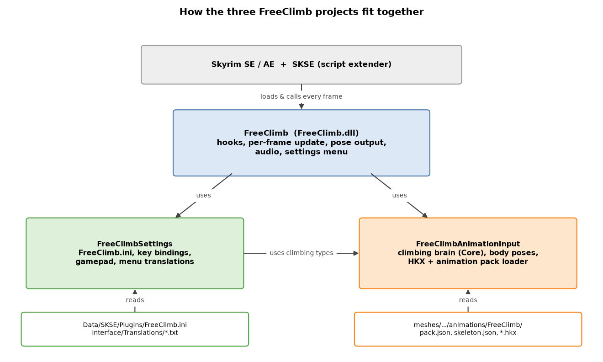
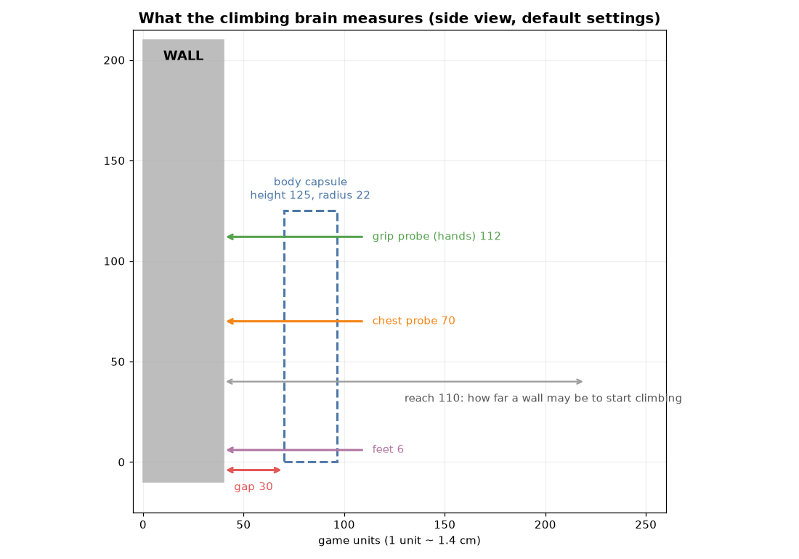
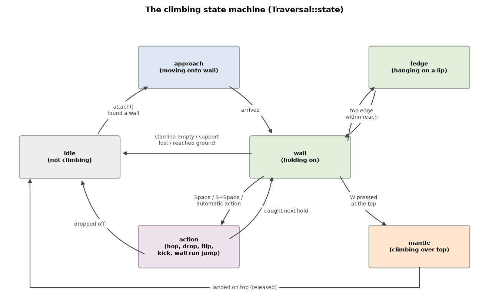
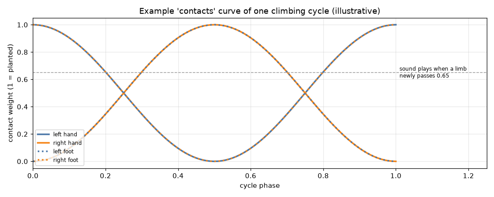
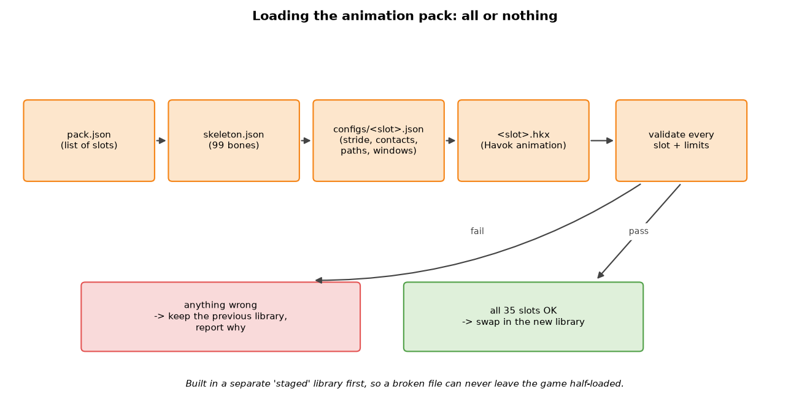
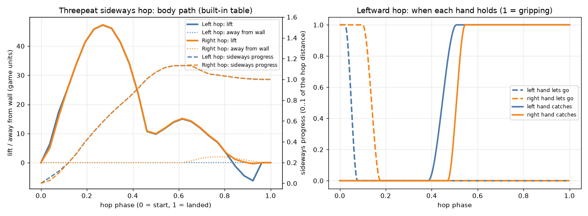

# FreeClimbAnimationInput — the climbing brain and the animation input

[FreeClimb](FreeClimb.md) · **FreeClimbAnimationInput** · [FreeClimbSettings](FreeClimbSettings.md)

This project is the part of FreeClimb that **thinks**. It decides *where* the
player can hold on, *how* the body moves along a wall, *which* animation to
show, and *how* that animation is bent so the hands and feet land on real
geometry. It also **reads the animation files** (`pack.json` and `.hkx`)
that give the body its movements.

Nothing in here talks to Skyrim directly. The game is only seen through a
tiny "ask a question about the world" interface (a ray cast). That is why
the whole climbing logic can be tested on a normal PC with fake worlds,
without starting the game.



---

## Contents

1. [Words used in this document](#1-words-used-in-this-document)
2. [What is inside the project](#2-what-is-inside-the-project)
3. [The climbing brain (`traversal/`)](#3-the-climbing-brain-traversal)
4. [Body poses (`pose/`)](#4-body-poses-pose)
5. [Animation input (`animation/`)](#5-animation-input-animation)
6. [Safety rules used everywhere](#6-safety-rules-used-everywhere)
7. [File reference](#7-file-reference)

---

## 1. Words used in this document

| Word | Plain meaning |
| --- | --- |
| **Game unit** | Skyrim's distance unit. 1 unit ≈ 1.4 cm, so the player is about 125 units tall. |
| **Ray / ray cast** | An invisible laser from point A to point B. The game answers "did it hit something, where, and which way does that surface face?". This is the *only* way the brain sees the world. |
| **Normal** | An arrow pointing straight *out* of a surface. A wall's normal points horizontally toward you; a floor's normal points up. |
| **Bone** | One joint of the character skeleton (hip, elbow, finger…). FreeClimb uses a fixed list of **99 bones**. |
| **Pose** | The position and rotation of all 99 bones at one moment — one "frame" of the body. |
| **Clip / animation** | A sequence of poses over time, e.g. "climb up one step". |
| **Phase** | How far through a clip or move we are: `0` = start, `1` = end. |
| **Motion** | Which clip should be shown right now (`hang`, `up`, `hopLeft`, `contextMantle`, …). |
| **IK (inverse kinematics)** | "I know where the hand must go — bend the shoulder and elbow so it gets there." |
| **Threepeat** | A set of hand-made animations (hang, sideways hops, mantle) that need *measured* hand holds. |

---

## 2. What is inside the project

```text
FreeClimbAnimationInput/
├─ include/
│  ├─ traversal/   the climbing brain (state machine, wall search, moves)
│  ├─ pose/        bone math, the motion library, fitting poses to walls
│  └─ animation/   animation pack format, HKX decoding, slot names
├─ src/            the parts that are not header-only:
│                  HKX decoding, HKX overrides, animation pack loading
└─ xmake.lua       builds the static library "FreeClimbAnimationInput"
```

Most of the code is **header-only** (it lives in `.h` files). Only file
reading and decoding live in `.cpp` files.

---

## 3. The climbing brain (`traversal/`)

### 3.1 How the brain sees the world

The brain never touches game objects. It only gets this interface
(`traversal/Core.h`):

```text
   World::ray(from, to)  ──►  "nothing"   or   Hit { point, normal, climbable }
```

* `climbable` is `false` for things you must not grab (water, actors,
  invisible trigger boxes, the player's own body…). The plugin decides that
  (see [FreeClimb.md](FreeClimb.md#4-seeing-the-world-gameworld)).
* In tests, `World` is a little program that describes boxes and slopes; in
  the game it fires real Havok physics rays.

### 3.2 The body the brain imagines

Before anything moves, the brain checks whether the **body capsule** fits.
These are the default measurements (`Settings` in `Core.h`):



| Setting | Default | Meaning |
| --- | ---: | --- |
| `gap` | 30 | Distance between the wall and the feet while climbing. |
| `radius` / `height` | 22 / 125 | Size of the body capsule used for "does it fit?" checks. |
| `grip` | 112 | Height of the hands above the feet; the main wall probe. |
| `chest` | 70 | Second wall probe at chest height. |
| `reach` | 110 | How far away a wall may be when you start climbing. |
| `maxNormalZ` | 0.70 | Steepest surface still counted as a *wall* (a value near 1 would be a floor). |
| `climbSpeed` / `sideSpeed` / `downSpeed` | 100 / 82 / 64 | Movement speeds in units per second (overridden by the INI). |
| `drain` / `hangDrain` | 10 / 0 | Stamina spent per second while moving / while holding still. |

### 3.3 The state machine

At every moment the brain is in exactly one **state**:



```text
idle ──attach()──► approach ──arrived──► wall ◄──► ledge
 ▲                                        │  │
 │                                        │  └─ W at the top ─► mantle ─┐
 │◄──────── stamina / support lost ───────┘                            │
 │◄──── dropped off ── action ◄── hop / drop / flip / automatic         │
 └───────────────────────── landed on top ─────────────────────────────┘
```

| State | What the player sees |
| --- | --- |
| `idle` | Normal Skyrim. FreeClimb only watches the keys. |
| `approach` | The short move from where you stood onto the wall (a reach or a jump catch). |
| `wall` | Holding on to a wall, moving with W/A/S/D. |
| `ledge` | Hanging on a top edge ("lip"), ready to climb over. |
| `mantle` | Pulling yourself over the top and standing up. |
| `action` | A scripted move with a fixed path: hop, drop, back flip, wall kick, wall-run jump. |

### 3.4 Starting a climb: `attach()`

When you press the entry chord (default **W+A+D+Space**) or jump at a wall,
the plugin calls `Traversal::attach(world, feet, facing, stamina, …)`.

```text
            -60°  -40°  -20°   0°  +20°  +40°  +60°
               \     \     \   |   /     /     /
                \     \     \  |  /     /     /
                 \     \     \ | /     /     /
                        ( the player )

  1. Fire probes in a fan around the facing direction (centre first).
  2. For each candidate wall hit:
       - is it climbable and steep enough?   (not a floor, not a ceiling)
       - is it wide and continuous enough?    (gripSupport)
       - does the body capsule fit there?     (clearPath)
       - can the body travel there on a path? (entryPathClear, jump arcs)
  3. Pick the nearest candidate that passed everything.
  4. Not found? remember the *closest* reason in `lastFailure`
     (noWall, surface, support, clearance, tooFar, stamina...).
```

A short **cooldown** (0.6 s after letting go) stops you from re-attaching to
the same wall immediately. A **jump grab while already in the air** is
allowed to skip the cooldown so you can catch walls while falling.

### 3.5 One step of climbing: `update()`

`Traversal::update(world, input, dt, stamina)` runs once per frame
(`dt` = frame time, capped at 50 ms so a lag spike cannot teleport you).

```text
 input ──► 1. let go?  (release key, S+Space back drop, back flip if room)
           2. running an action / approach / mantle?  advance it and stop here
           3. planned edge hop or corner turn?        advance it
           4. new requests?  mantle (W at a top), hop (Space), wall run (Shift),
                             automatic action (if enabled and holding a direction)
           5. move along the wall:
                - find the wall again around the new position (support)
                - if it is gone, keep trying for up to 1.2 s, then let go
                - choose the motion: up / down / left / right / run... / hang
                - spend stamina (wall running costs double)
                - moving down onto the ground ends the climb
 ──► Result { motion to show, stamina cost, released?, reason }
```

The `Result.reason` text ("stamina exhausted", "support lost after
retries", "descending reached ground"…) ends up in the log so problems are
easy to understand.

### 3.6 Finding a top to climb over

When you press **W** near the top of a wall, the brain looks for a
**ledge**: a place where you can stand, with a lip your hands can hold.

```text
   side view                           what is checked
   ─────────                           ───────────────
        standing spot  ●─────────      1. a walkable floor above (normal.z >= 0.70)
   lip ──►  ┌──────────                2. room to stand there (body capsule fits)
            │                          3. the lip itself, for both hands
            │  wall                    4. a clear, rounded path from the wall to the top
            │                          5. special cases: roof crests (/\), recessed
   player ► │                             walls, eaves overhanging the side
```

Three searches are tried, all inside a **budget of 4096 rays** so a strange
mesh can never freeze the game: a roof **crest**, the **face edge** straight
above, and a **reachable floor**. The mantle then follows a curve from
`topStart` through an apex to `topTarget`.

### 3.7 Moves with a fixed path (`action`)

| Move | Trigger | Notes |
| --- | --- | --- |
| Drop | Let go | Short (0.16 s) push away from the wall. |
| Back drop | S + Space | Jumps backwards; shortened if something is behind you. |
| Back flip | S + Space with *Fancy jumps* | Path checked in 12 segments with a 13-sphere body; falls back to a back drop if blocked. |
| Hop | Space (+ direction) | To another hold or along the wall; arc checked for collisions. |
| Obstacle jump (wall kick) | Wall running into an obstacle (automatic, *Wall-run obstacle jumps*) | Kicks up, left or right over it; the 32-point arc and the extra space (`kickClearance`) are checked first. Costs 30 stamina. |
| Corner turn | Moving sideways into a corner | Follows a smooth route of up to 24 points around the corner. |

Corners deserve a picture. Seen from above:

```text
            target face
                │
                │  ← route points (up to 24) bend around the join
   ─────────────┘● ● ●
   source face        ●
                       ● player
```

### 3.8 Measured hand holds (Threepeat, edge actions)

The Threepeat animations need the hands to land on **real** edges. Before a
sideways hop the brain:

1. finds a **source** edge under the current hands and a **target** edge in
   the hop direction (`findGripEdge`, at most 96 rays),
2. checks the feet will find wall under both holds,
3. checks the body path of the hop is clear,
4. lets the hands **settle** on the source edge for a moment,
5. only then **commits** the hop.

If anything changes during these steps (new input, the edge moved) the plan
is cancelled and the reason is shown in diagnostics (`edgePlanReason`).

### 3.9 Automatic actions

If *Automatic climb actions* is on and you hold a direction on a plain wall,
the brain occasionally performs a hop on its own, at a random interval
between `AutoActionMinSeconds` and `AutoActionMaxSeconds`. The side weights
(`LeftWeight`, `RightWeight`) bias left vs right. The random numbers come
from a tiny deterministic generator (xorshift), so captured situations can
be replayed exactly.

### 3.10 Ground-entry protection

`traversal/NativeWalkableApproach.h` stops FreeClimb from grabbing things you
could simply **walk** onto:

```text
   ramp you can walk up          low box / step               staircase
        ____                        ┌──┐                       _
   ____/                         ___│  │___                 _| |_
   → walkable: no climb          → step-over: no climb      → stairs: no climb
```

It probes the ground ahead in small steps (rise ≤ 16 units per step) within
3072 rays. Running out of rays counts as "not walkable" (safe default).

---

## 4. Body poses (`pose/`)

### 4.1 Bones, transforms and poses

```text
   Transform = { t: position, q: rotation (quaternion), s: scale }
   Pose      = 99 Transforms, each relative to its parent bone

         NPC Root
            └─ COM (centre of mass, bone 4)
                ├─ Pelvis ─ Thighs ─ Calves ─ Feet ─ Toes      (6..11, 50, 51)
                └─ Spine ─ Spine1 ─ Spine2 (24..26)
                     ├─ Neck ─ Head
                     ├─ L Clavicle ─ L UpperArm(28) ─ L Forearm(29) ─ L Hand(38) ─ fingers(67..)
                     └─ R Clavicle ─ R UpperArm(31) ─ R Forearm(32) ─ R Hand(39) ─ fingers(82..)
```

`Pose.h` contains the math: rotating vectors, blending two rotations
smoothly ("slerp"), composing a child with its parent, and converting a
local pose into world positions.

### 4.2 The motion library (`Library`)

The library holds **one clip per motion slot** (35 active slots) plus the
skeleton. Each clip stores:

| Field | Meaning |
| --- | --- |
| `frames` | The poses, evenly spaced in time. |
| `seconds` | Length of the clip. |
| `stride` | How far one cycle moves you (used to sync limbs with movement). |
| `contacts` | Per frame: how much the left hand, right hand, left foot and right foot are *planted* (0–1). |
| `height`, `travel` | Reference lift and displacement for mantles and hops. |

**Sampling** a clip at a phase picks the two nearest frames and blends them:

```text
   frames:   F0 ──── F1 ──── F2 ──── F3        phase 0.55 of 4 frames
                              ▲
                     55% of the way from F1 to F2 → blended pose
```



The contact curve tells the solver which limbs should stick to the wall and
also tells the sound system when a hand or foot "lands" (see
[FreeClimb.md](FreeClimb.md#7-sounds)).

### 4.3 Bending an arm or leg to a target (IK)

```text
        shoulder ●
                  \  upper arm
                   \
             elbow  ●          ← elbow is placed so both bone lengths stay the same
                   /              and it bends toward the "pole" direction
          forearm /
                 ● hand ──► target on the wall
```

`Library::ik()` solves this two-bone problem. For arms it also checks that
the elbow does **not bend backwards**; if the first solution would
hyper-extend the elbow it tries the other bend direction, and as a last
resort rotates the forearm just past straight (`guardArmBend`). Wrists are
limited to 95° (`guardWristFlexion`).

### 4.4 Adapting to the real character (`PoseRig`)

Body mods can change bone lengths and scales. Animations are authored for
the default skeleton, so `PoseRig` re-targets every pose:

```text
   authored skeleton            live skeleton (longer arms)
        O                             O
       /|\        ── PoseRig ──►     /|\
       / \                          /   \
   keeps the *offset* from rest pose, keeps the *ratio* of scales,
   lets the root and COM move freely
```

### 4.5 Fitting a pose to the wall every frame (`SurfacePose`)

`SurfacePose::update()` is the heart of the visible movement. Each frame:

```text
 1. sample the clip of the current motion at the right phase
      (climb cycles advance with distance moved / stride)
 2. measure the real wall distance with 3 rays at grip and chest height
      and ease toward it (no popping when walls are bumpy)
 3. place the body: tilt onto sloped walls, side-run lean, parkour orientation
 4. blend from the previous motion (0.18 s by default); on a stop, pick the
      bridge pose that looks closest to the last frame
 5. plant hands and feet: for each limb with contact weight, ray-cast the real
      surface and IK the limb there (or onto measured edges / the ledge top)
 6. guard elbows and wrists, record how far limbs missed their targets
```

The miss distances (`maxReachError`, `topPalmError`, …) are shown in the
diagnostics log and help tune animations.

### 4.6 Special moves

* **`BackFlipPose.h`** — places the flip clip against the wall and checks
  the whole body (13 spheres) stays clear along the flight.
* **`SideRunPose.h`** — when running sideways along a wall, leans the body
  into the wall (default 28°), sways it with the steps, and reaches the
  inner hand to touch the wall.

---

## 5. Animation input (`animation/`)

### 5.1 The animation pack on disk

```text
Data/meshes/actors/character/animations/FreeClimb/
├─ pack.json          the list: slot name → config file
├─ skeleton.json      the 99 bones: name, parent, rest transform
├─ configs/
│  ├─ hang.json       one config per slot (stride, contacts, ...)
│  ├─ up.json
│  └─ ...
├─ hang.hkx           one Havok animation per slot
├─ up.hkx
└─ ...                35 slots in total
```

The 35 slot names and their order are fixed in `animation/MotionSlots.h`
(`hang`, `up`, `down`, `left`, `right`, `reach`, `hopLeft`, …,
`contextMantle`). A compile-time check guarantees the names and the list of
active motions in `Core.h` always agree.

### 5.2 What a slot config contains

| Field | Used for |
| --- | --- |
| `format`, `version`, `slot` | Identify the file; `slot` must match the slot it is listed under. |
| `file` | The HKX file, relative to the animation folder. |
| `stride` | Distance per cycle (0–500). |
| `contacts` | Rows of 4 contact weights; resampled to the HKX frame count. |
| `height`, `travel` | Reference lift / displacement (−500…500). |
| `path`, `sourceHands`, `targetHands`, `verticalBlend` | Threepeat hops only: body path and hand timing windows. |
| `unplant`, `replant`, `releaseHands`, `replantSamplePhase` | Threepeat mantle only: when hands lift and replant. |

### 5.3 Loading is "all or nothing"



`loadAnimationPack()` builds a completely new library on the side
("staged"). Only when **every** slot loaded and passed validation is it
swapped in. A single bad file means the old, working library stays — the
game never runs with half a pack. Limits protect against huge or broken
files:

| Limit | Value |
| --- | ---: |
| One file | 64 MB |
| All files | 256 MB |
| Frames per clip | 1201 |
| Decoded pose memory | 128 MB |
| Decode time per file / total | 3 s / 30 s |

### 5.4 Decoding an HKX file

HKX is Havok's binary format. `HkxAnimation.cpp` reads it step by step and
refuses anything it does not fully understand:

```text
 .hkx bytes
   │
   ├─ packfile header (Havok 2010.2, 64-bit, little endian)
   ├─ sections: __classnames__ (type names)  __data__ (objects)
   │
   ├─ hkaAnimationBinding  ── which track drives which bone
   └─ the animation itself, one of:
        hkaInterleavedUncompressedAnimation   every frame stored as-is
        hkaSplineCompressedAnimation          curves stored compactly
                                              (decoded by HkxSpline.cpp)
   │
   ▼
 HkxClip { duration, track → bone mapping, rotations, full poses per frame }
```

Then `AnimationSkeletonBinding.h` (in the plugin project) and the pack
loader check that the animation's skeleton really matches the 99 canonical
bones (names, parents, no loops).

### 5.5 The Threepeat profile

Threepeat hops and the mantle need precise timing. The profile stores
**paths** and **hand windows** (when each hand lets go and catches). The
built-in default comes from `animation/ThreepeatMotion.h`; a pack can supply
its own in the config files.



* Left plot: the body rises ~47 units early in the hop, travels sideways
  (shown as a 0–1 fraction of the hop distance, overshooting slightly before
  settling) and stays close to the wall.
* Right plot: for a leftward hop, the left hand releases first, then the
  right; at the end the left hand catches first, then the right. The ramps
  use a smooth "ease" curve so the hands never snap.

### 5.6 Loose HKX overrides (legacy)

`AnimationOverrides.cpp` can replace the **rotations** of selected bones of
a slot with a loose `<slot>.hkx` file. A rejected file only affects its own
slot; the built-in motion is kept for it.

---

## 6. Safety rules used everywhere

* **Every number is checked.** Positions, normals and times that are not
  finite (`NaN`, infinity) are rejected before use.
* **Every search has a budget.** Ray searches stop after a fixed number of
  rays (96, 1800, 3072 or 4096 depending on the search) and fail safely.
* **Frame time is capped** at 50 ms everywhere, so lag spikes cannot move
  the body far.
* **Failed searches back off** (`SearchRetry`): the same failing search is
  not repeated every frame while nothing has changed.
* **Replays are exact.** The brain only uses `World::ray` and its own
  deterministic random numbers, so a recorded situation replays bit for bit
  (see [FreeClimb.md](FreeClimb.md#11-diagnostics)).

---

## 7. File reference

| File | What it does |
| --- | --- |
| `traversal/Core.h` | Vectors, `World`, `Settings`, motions, states, and the `Traversal` state machine. |
| `traversal/CornerTraversal.h` | Routes around inside/outside corners. |
| `traversal/GripEdge.h` | Finds lips and wall patches both hands can hold. |
| `traversal/EdgePlan.h` | Planning data and status texts for edge hops. |
| `traversal/EdgeActions.h` | Threepeat hang/hop/mantle selection and validation (part of `Traversal`). |
| `traversal/EaveTraversal.h` | Moving past overhangs (part of `Traversal`). |
| `traversal/RecessedWallTransfer.h` | Jumping up onto a set-back wall (part of `Traversal`). |
| `traversal/SearchRetry.h` | Back-off for failed searches. |
| `traversal/TopCandidateSearch.h` | Ray budget and lane search for ledge tops. |
| `pose/Pose.h` | Quaternions, transforms, the `Library` of clips, IK and limb guards. |
| `pose/PoseRig.h` | Re-targeting to the live skeleton. |
| `pose/SurfacePose.h` | Per-frame pose fitting to the wall. |
| `pose/BackFlipPose.h`, `pose/SideRunPose.h` | Back flip placement / side-run lean and palm. |
| `pose/PoseContinuation.h` | Keeps a pose moving briefly when its source ends. |
| `animation/MotionSlots.h` | Slot names. |
| `animation/CanonicalSkeleton.h` | The 99 canonical bones and their rest pose. |
| `animation/ThreepeatMotion.h` | Threepeat paths and hand timing (generated by `tools/retarget_threepeat.py`). |
| `animation/HkxAnimation.h`, `src/HkxAnimation.cpp` | HKX decoder. |
| `animation/HkxSpline.h`, `src/HkxSpline.cpp` | Spline-compressed animation decoder. |
| `animation/AnimationPack.h`, `src/AnimationPack.cpp` | `pack.json` loader (all or nothing). |
| `animation/AnimationOverrides.h`, `src/AnimationOverrides.cpp` | Loose HKX rotation overrides. |
