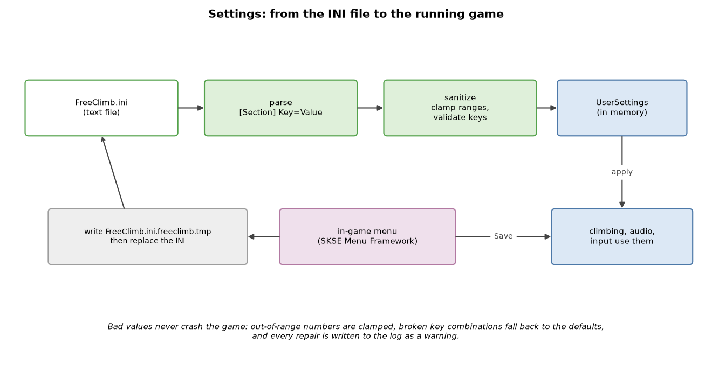
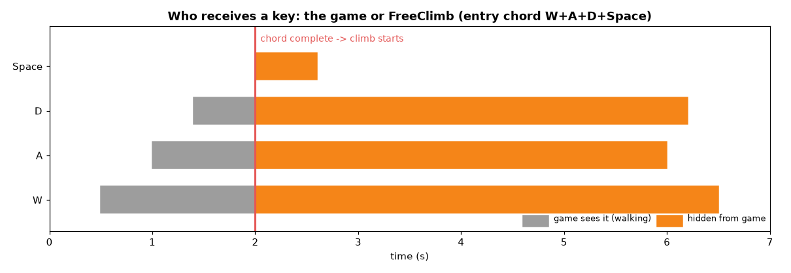
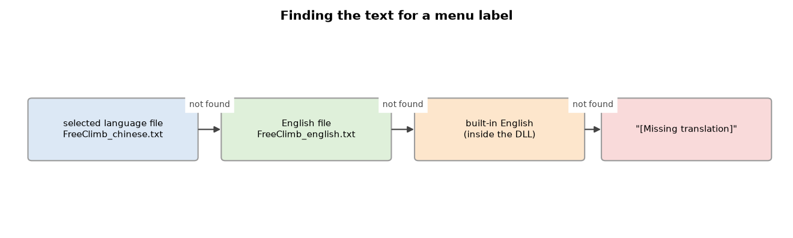

# FreeClimbSettings — settings, key bindings and translations

[FreeClimb](FreeClimb.md) · [FreeClimbAnimationInput](FreeClimbAnimationInput.md) · **FreeClimbSettings**

This project is everything the **player can configure**:

* the settings file `Data/SKSE/Plugins/FreeClimb.ini`,
* keyboard and gamepad **key combinations** ("chords"),
* turning held keys into **climbing input**,
* the menu **translations** (`Interface/Translations/FreeClimb_*.txt`).

It has one golden rule: **a bad setting must never break the game.** Every
value is checked, out-of-range numbers are pulled back into range, broken
key combinations fall back to the defaults, and each repair is written to
the log as a warning.

```text
FreeClimbSettings/
├─ include/
│  ├─ settings/   UserSettings (INI), TranslationCatalog, built-in English texts
│  ├─ input/      keyboard chords (InputBindings), gamepad (GamepadInput)
│  └─ traversal/  Controls.h: keys → climbing input, entry & jump-grab timing
├─ src/           UserSettings.cpp (INI read/write), TranslationCatalog.cpp
└─ xmake.lua      static library; depends on FreeClimbAnimationInput
```

> It depends on [FreeClimbAnimationInput](FreeClimbAnimationInput.md) only
> for the climbing types (`Input`, `Motion`, `Vec`) that key presses are
> turned into.

---

## Contents

1. [The life of a setting](#1-the-life-of-a-setting)
2. [Every INI setting](#2-every-ini-setting)
3. [Key chords](#3-key-chords)
4. [From keys to climbing input](#4-from-keys-to-climbing-input)
5. [Gamepad support](#5-gamepad-support)
6. [Menu translations](#6-menu-translations)
7. [File reference](#7-file-reference)

---

## 1. The life of a setting



### 1.1 Reading the INI

`loadUserSettings()` reads the file line by line:

```text
[Movement]            ← a section
UpSpeed=100           ← Key=Value   (section and key names ignore case)
WallRunSpeed=379.5 ; comment after ';' or '#' is ignored
Enabled=true          ← booleans: 1/0 or true/false
```

```text
           ┌────────────── value present? ──────────────┐
           │ no                                         │ yes
           ▼                                            ▼
     keep the default                        a number / true / false?
                                               │ yes            │ no
                                               ▼                ▼
                                          use it        warning: "invalid value;
                                                        using default"
```

A missing file is fine too: every setting then uses its default and the log
says "Settings file unavailable; using defaults".

### 1.2 Sanitizing

`sanitizeUserSettings()` then makes everything safe:

* each number is **clamped** into its allowed range (table below),
* `NaN` / infinity becomes the default,
* `AutoActionMaxSeconds` is never smaller than `AutoActionMinSeconds`,
* `WallRunSpeed=0` means "use the default" (379.5),
* `LegacyAutomaticHops` is always switched off (the old behaviour is retired),
* side weights are kept between 0 and 1,
* key bindings that are invalid or conflict are replaced by the defaults.

### 1.3 Saving from the menu

When you press **Save** in the in-game menu, `saveUserSettings()`:

```text
 1. refuse to save invalid key bindings (error shown in the menu)
 2. write everything to  FreeClimb.ini.freeclimb.tmp
 3. replace FreeClimb.ini with the finished temporary file
```

Writing to a temporary file first means a crash or a full disk can never
leave you with a half-written INI.

### 1.4 Resetting one page

`restoreSettingsPage()` resets only the fields of one menu page (General,
Movement, Automatic, Stamina, Audio, Keys, Diagnostics) and leaves the rest
as they are.

---

## 2. Every INI setting

### 2.1 Numbers (with allowed ranges)

| Section | Key | Default | Range | Meaning |
| --- | --- | ---: | :---: | --- |
| Movement | `UpSpeed` | 100 | 10–140 | Climbing up, units/s. |
| Movement | `DownSpeed` | 78 | 10–140 | Climbing down, units/s. |
| Movement | `SideSpeed` | 82 | 10–120 | Climbing sideways, units/s. |
| Movement | `WallRunSpeed` | 379.5 | 0–450 | Wall running speed. |
| Movement | `DiagonalRunMultiplier` | 1.15 | 1–1.3 | Extra speed for diagonal wall runs. |
| Movement | `AutoActionMinSeconds` | 0.8 | 0.65–20 | Shortest wait between automatic actions. |
| Movement | `AutoActionMaxSeconds` | 1.25 | 0.65–30 | Longest wait between automatic actions. |
| Movement | `HopOutDistance` | 32 | 24–55 | How far a hop pushes away from the wall. |
| Movement | `KickOutDistance` | 52 | 36–75 | How far a wall kick pushes away. |
| Audio | `Volume` | 0.75 | 0–1 | Traversal sound volume. |
| Detection | `Reach` | 110 | 40–160 | Max distance to a wall when starting a climb. |
| Detection | `GrabMaxSnap` | 60 | 5–60 | Max snap distance for a jump grab. |
| Detection | `GroundJumpHeight` | 88 | 0–88 | Height of the jump when starting from the ground. |
| Detection | `MaxNormalZ` | 0.70 | 0.2–0.75 | Steepest slope still treated as a wall. |
| Stamina | `MovingPerSecond` | 10 | 0–50 | Stamina cost while moving. |
| Stamina | `HangingPerSecond` | 0 | 0–30 | Stamina cost while holding still. |
| Stamina | `RequiredToGrab` | 12 | 0–100 | Stamina needed to start climbing. |
| AutomaticActions | `LeftWeight` / `RightWeight` | 1 / 1 | 0–1 | Chance an automatic action may go left / right. |

### 2.2 Switches (1 = on, 0 = off)

| Section | Key | Default | Meaning |
| --- | --- | :---: | --- |
| General | `Enabled` | 1 | FreeClimb on/off. |
| General | `Notifications` | 1 | HUD messages. |
| General | `LowStaminaNotifications` | 1 | Warn when stamina is low. |
| General | `JumpToAttach` | 1 | Jumping at a wall grabs it. |
| General | `AutoMantle` | 1 | Holding W at the top climbs over. |
| General | `ContextActions` | 1 | Measured edge actions (sideways hops between holds). |
| General | `ThreepeatAnimations` | 1 | Use the Threepeat hang/hop/mantle animations. |
| General | `AutomaticClimbActions` | 1 | Occasional automatic hops while climbing. |
| General | `LegacyAutomaticHops` | 0 | Retired; always forced off when loading. |
| General | `SurfaceActionVariants` | 1 | Sideways hops on flat walls. |
| General | `WallRunObstacleJumps` | 1 | Jump over obstacles while wall running. |
| General | `Diagnostics` | 0 | Detailed log output. |
| Movement | `FancyJumps` | 1 | Back flips and longer hop arcs. |
| Audio | `Enabled` | 1 | Traversal sounds. |
| Stamina | `Enabled` | 1 | Climbing costs stamina. |
| AutomaticActions | `ContextualMantleEnabled` | 1 | Threepeat mantle at suitable tops. |

### 2.3 Text values

| Section | Key | Default | Meaning |
| --- | --- | --- | --- |
| Menu | `Language` | `english` | Menu language (see [§6](#6-menu-translations)). |
| Controls | `Forward` / `Backward` / `Left` / `Right` | `W` / `S` / `A` / `D` | Climb directions. |
| Controls | `Entry` | `W+A+D+Space` | Start climbing. |
| Controls | `RunModifier` | `Shift` | Hold to wall run. |
| Controls | `Hop` | `Space` | Hop to the next hold. |
| Gamepad | `Enabled`, `Deadzone`, `TriggerThreshold` | 1, 0.25, 0.5 | See [§5](#5-gamepad-support). |
| Gamepad | `Entry` / `RunModifier` / `Hop` / `Drop` | `LB+Y` / `LB` / `Y` / `B` | Gamepad actions. |

---

## 3. Key chords

A **chord** is 1 to 4 keys held at the same time, written with `+`:

```text
  "W+A+D+Space"   "Shift"   "Ctrl+F"   "LShift+Num8"
```

### 3.1 Key names

* Letters `A`–`Z`, digits `0`–`9`, `F1`–`F12`, arrows `Up/Down/Left/Right`,
  `Space`, `Tab`, `Enter`, `Backspace`, `CapsLock`, punctuation names
  (`Minus`, `Comma`, `Slash`…), navigation keys and the number pad
  (`Num0`–`Num9`, `NumEnter`, …).
* `Shift`, `Ctrl`, `Alt` mean **either side**; `LShift`, `RCtrl`, … mean
  one specific side.
* Aliases: `Control` → `Ctrl`, `Spacebar` → `Space`, `Return` → `Enter`.
* Names ignore upper/lower case and surrounding spaces.

### 3.2 What makes a chord invalid

```text
  ✗ ""                      empty
  ✗ "W+W"  "Shift+LShift"   the same key twice (LShift is already a Shift)
  ✗ "A+B+C+D+E"             more than 4 keys
  ✗ "Alt+Tab"  "Alt+F4"     Windows shortcuts
  ✗ "Ctrl+Alt+Delete"
  ✗ "Banana"                unknown key name
```

### 3.3 Rules between different actions

`validateBindings()` checks the whole set, because some combinations would
make the controls ambiguous:

| Rule | Why |
| --- | --- |
| No action may contain another one completely (entry is the exception). | Pressing one would also trigger the other. |
| Direction keys may not share a key with the run modifier. | Running would also count as moving in that direction. |
| Entry may not contain the whole *backward* chord. | Starting a climb would immediately also mean "back off". |
| *backward + hop* (back drop) must fit into one valid chord of ≤ 4 keys. | You must be able to press it. |
| Each of *forward/left/right + run modifier* must fit into one valid chord. | You must be able to wall run in every direction. |

If any rule fails, the menu shows which two actions conflict, and an INI
with such a conflict falls back to the default bindings.

---

## 4. From keys to climbing input

### 4.1 Keys → `Input`

The plugin collects the held keys into a `Keys` record each frame and
`wallInput()` (in `traversal/Controls.h`) converts them:

| You hold… | Climbing input |
| --- | --- |
| W / S | `y = +1 / −1` (up / down) |
| A / D | `x = −1 / +1` (left / right) |
| Let go (gamepad B) or A+S+D+Space | **release** the wall |
| S + Space | **back drop** (or back flip with *Fancy jumps*) |
| Space (without S, not right after a wall run) | **hop** |
| W (with *AutoMantle*) | **mantle** when at the top |
| Shift (without S) | **run** along the wall |

A Space press that *started* the climb is ignored, so starting a climb does
not also hop.

### 4.2 Starting a climb: the entry gesture

```text
 ClimbEntryIntent
   ┌──────────┐ chord pressed ┌──────────┐ climb begins ┌──────────────────┐
   │  ready   │──────────────►│ gesture  │─────────────►│ blocked until    │
   └──────────┘               └──────────┘              │ chord released   │
        ▲                         │ S pressed            └────────┬─────────┘
        │                         ▼                               │
        └────────── chord released ───────────────────────────────┘
```

* After a climb ends (or while S is held) the chord must be **released
  once** before it counts again — no accidental re-grab.
* `EntryPreparationGrace` keeps the request alive for **150 ms** while the
  plugin prepares the character's pose.
* `JumpGrabGate` opens a **0.8 s** window after a jump in which a wall in
  front can be caught. A grab requested while already in the air may ignore
  the re-attach cooldown.
* `WallRunEntryGate`: if Shift was already held when the climb began, it
  does not count as "run" until you release and press it again.

### 4.3 Who gets the key: the game or FreeClimb?

While you climb, the keys of your bindings must **not** also reach the game
(otherwise W would make you walk and Space would make you jump).



`InputOwnership` (keyboard) and `GamepadOwnership` (controller) decide this
for every key event:

```text
   key pressed while a binding using it is fully held and you are climbing
        → FreeClimb owns it: the game never sees press or repeats
   key pressed before climbing (the game already saw the press)
        → the game keeps it, and also gets its release
        (so the game never thinks a key is stuck)
   after letting go, direction keys you still hold go back to the game,
        so you keep walking without re-pressing them
```

---

## 5. Gamepad support

### 5.1 Buttons

```text
   index:  0 DPadUp   1 DPadDown  2 DPadLeft  3 DPadRight
           4 Start    5 Back      6 LS        7 RS
           8 LB       9 RB       10 A        11 B
          12 X       13 Y        14 LT       15 RT
```

* Gamepad chords use the same `+` syntax: `LB+Y`.
* **Start and Back are reserved** for game menus and cannot be bound.
* Triggers (LT/RT) count as pressed when pushed past `TriggerThreshold`
  (default 0.5, range 0.1–0.95).

### 5.2 Stick to directions

```text
            y
            ▲         deadzone (default 0.25): inside it, nothing happens
        ┌───┼───┐
        │   ○   │     outside: the direction is normalized, then each axis
   ─────┼───●───┼──► x   becomes -1 / 0 / +1:
        │       │        engages above 0.45, releases below 0.35
        └───────┘        (hysteresis: no flicker at the border)
```

### 5.3 Defaults

| Action | Default |
| --- | --- |
| Entry | `LB+Y` |
| Run modifier | `LB` |
| Hop | `Y` |
| Drop (let go) | `B` |

After the controller reconnects or a climb ends, the gamepad reports no
input until **all buttons are released** (`blockUntilButtonsReleased`), so
a held button cannot immediately trigger something new.

---

## 6. Menu translations

### 6.1 Files

```text
Data/Interface/Translations/
├─ FreeClimb_english.txt
├─ FreeClimb_chinese.txt
└─ FreeClimb_<language>.txt     ← add your own
```

Each file is UTF-8 or UTF-16 (with a byte-order mark). One text per line:

```text
$FC_LANGUAGE_NAME<TAB>简体中文
$FC_TITLE<TAB>攀岩
$FC_HELP<TAB>First line\nSecond line      ← "\n" becomes a new line
```

### 6.2 Looking up a text



For every label the catalog tries, in order: the selected language → the
English file → the built-in English text (compiled into the DLL from
`settings/TranslationDefaults.h`) → `"[Missing translation]"`.

### 6.3 Safety limits

| Limit | Value |
| --- | ---: |
| File size | 1 MB |
| Line length | 16384 bytes |
| Languages | 64 |
| Warnings kept | 192 |

* Only keys that exist in the built-in English list are accepted; unknown
  keys are ignored (and counted in a warning).
* Language ids are file-name based (`chinese`, `deutsch`, …); invalid ids
  such as `invalid/path` cannot read other files.
* A failed reload keeps the previous texts.
* The language list is sorted: English, Chinese, then the rest by id.

---

## 7. File reference

| File | What it does |
| --- | --- |
| `settings/UserSettings.h`, `src/UserSettings.cpp` | All settings, INI parsing, sanitizing, saving, page reset. |
| `settings/TranslationCatalog.h`, `src/TranslationCatalog.cpp` | Translation files and text lookup. |
| `settings/TranslationDefaults.h` | Built-in English texts (the list of valid keys). |
| `input/InputBindings.h` | Keyboard key names, chords, validation, key ownership. |
| `input/GamepadInput.h` | Gamepad buttons, chords, stick quantization, button ownership. |
| `traversal/Controls.h` | Keys → climbing `Input`, entry gesture, jump-grab window, Space ownership. |
